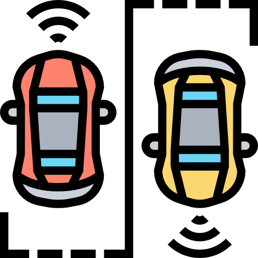
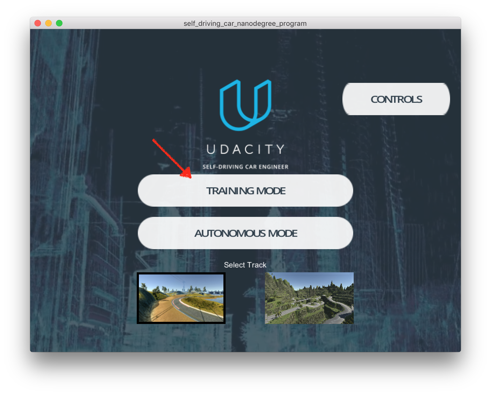
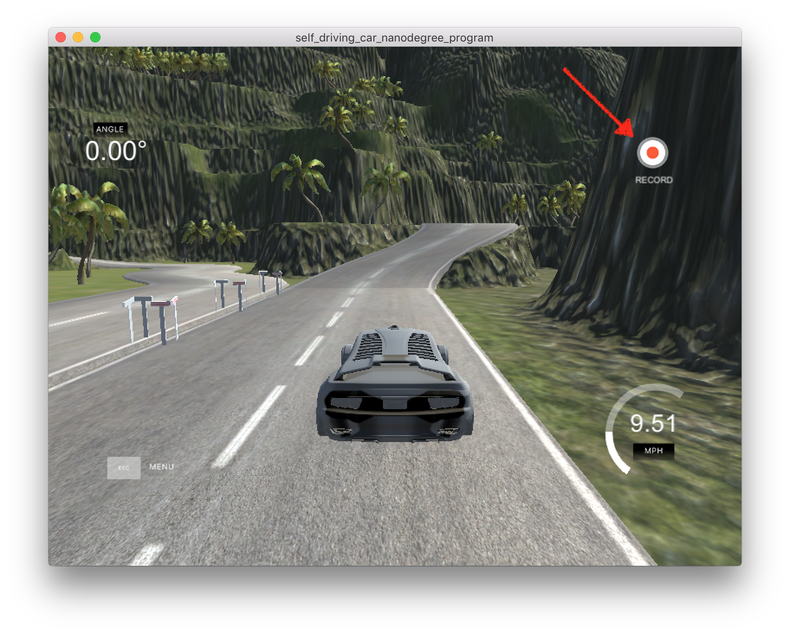
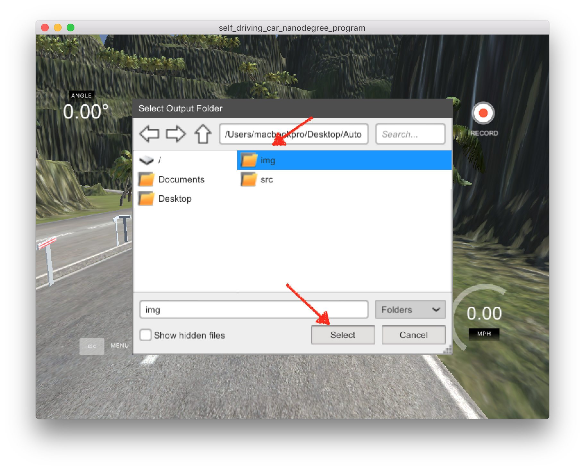
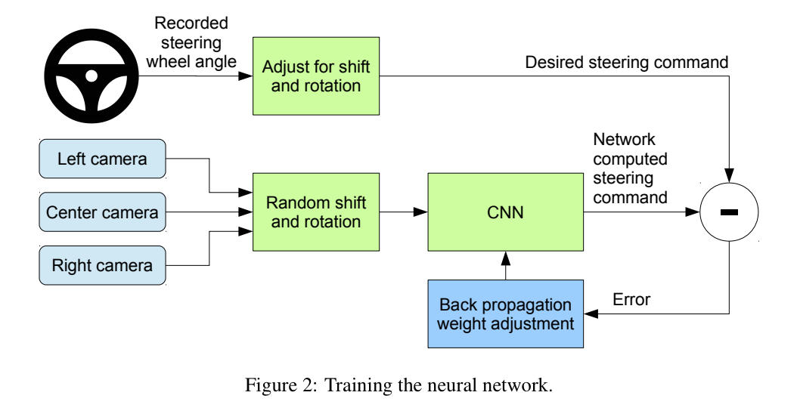
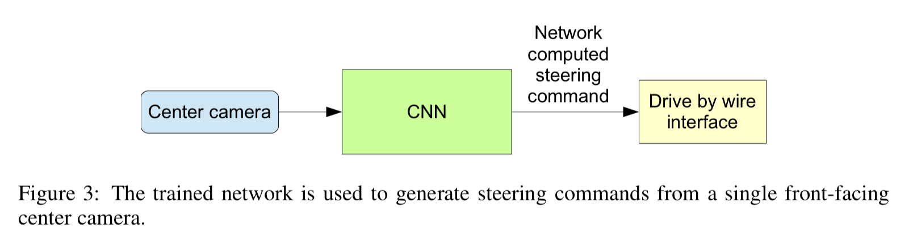
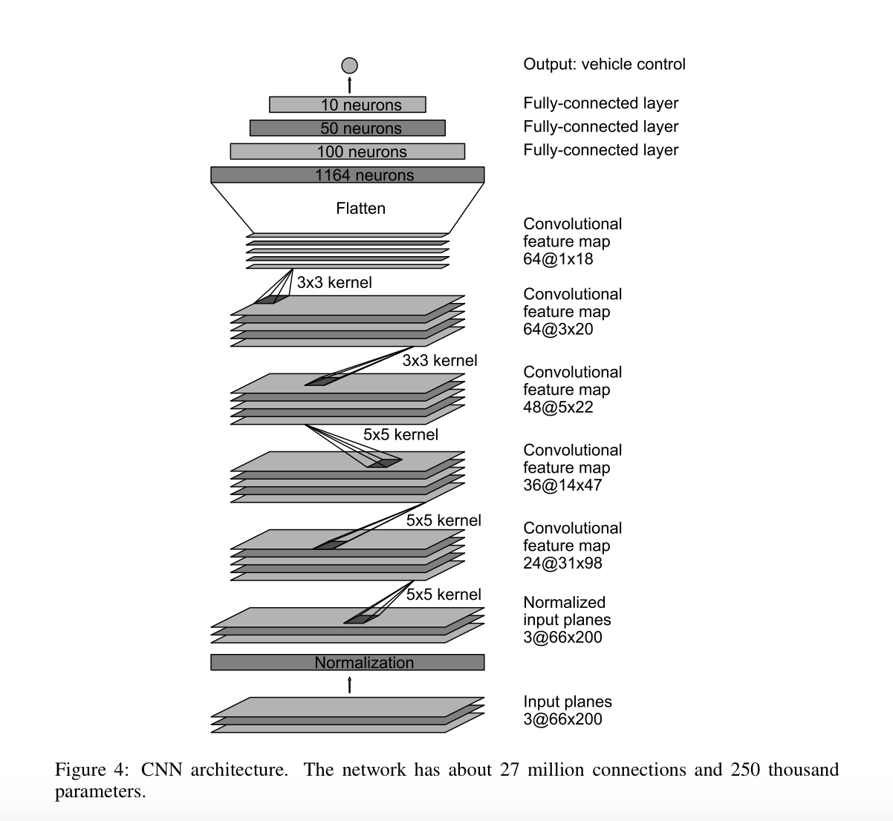
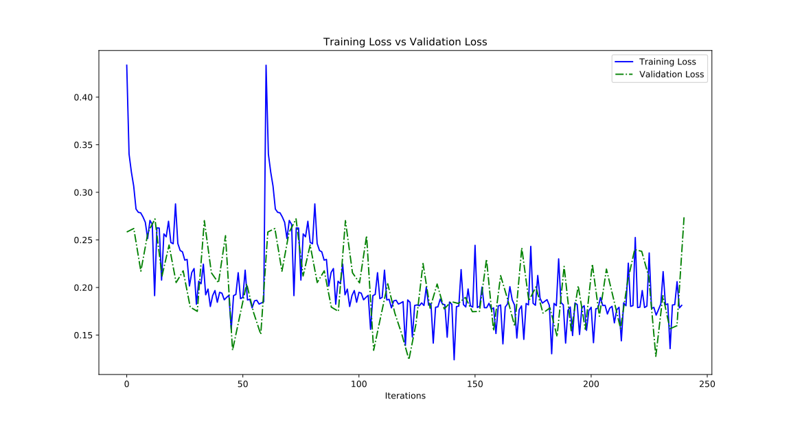
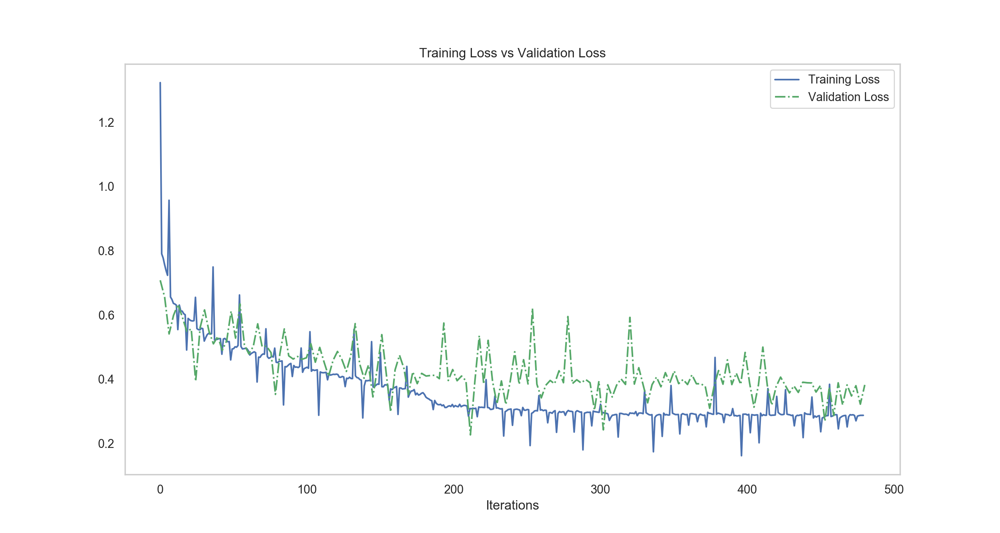

# Self-driving Vehicles Simulation using Machine Learning

<p align="center">
  
</p>

> Please install [Open in Colab](https://chrome.google.com/webstore/detail/open-in-colab/iogfkhleblhcpcekbiedikdehleodpjo) extension in Google Chrome in order to open a Github-hosted notebook in Google Colab with one-click.


## Table of Contents

- [Introduction](#introduction)
- [Prerequisite](#prerequisite)
- [Dataset](#dataset)
- [Usage](#usage)
    - [Training](#training)
        - [Local machine](#local-machine)
        - [Google Colab host](#google-colab-host)
    - [Evaluation](#evaluation)
    - [Create videos](#create-videos)
- [Project guide](#project-guide)
    - [1. Prepare training data](#1-prepare-training-data)
    - [2. Project code structure](#2-project-code-structure)
    - [3. Training neural network](#3-training-neural-network)
    - [4. Model architecture and hyper-parameters](#4-model-architecture-and-hyper-parameters)
        - [Model architecture](#model-architecture)
        - [Hyper-parameters](#hyper-parameters)
- [FAQ](#faq)
- [Result](#result)
    - [Training loss vs Validation loss](#training-loss-vs-validation-loss)
    - [Demo videos](#demo-videos)
- [References](#references)


## Introduction

Self-driving vehicles is the most hottest and interesting topics of research and business nowadays. More and more giant companies have jumped into this area. In this project, I have implemented the CNN model put forward by Nvidia Research in this [paper](https://arxiv.org/pdf/1604.07316v1.pdf) using PyTorch to extract features from 3 cameras in the vehicle simulation software to predict steering angle. This is an end-to-end approach to apply to autonomous driving.


## Prerequisite

We will use Python as the primary programming language and [PyTorch](https://pytorch.org/) as the Deep Learning framework. Other resources / software / library could be found as follows.


1. Self-driving car simulator developed by [Udacity](https://www.udacity.com/course/self-driving-car-engineer-nanodegree--nd013) with Unity. Download [here](https://github.com/udacity/self-driving-car-sim)
2. Install [PyTorch environment](https://pytorch.org/get-started/locally/) in your local machine.
3. Register account in [Google Colab](https://colab.research.google.com/) (if you do not have GPU and would love to utilize the power of GPU, please try this and be sure to enable `GPU` as accelerator)


## Dataset

I have already hosted training data (including track 1 and track 2 individually) in Floydhub. Feel free to download it [here](https://www.floydhub.com/zhenye/datasets/self-driving-sim).


## Usage

Download this repo.


```
git clone https://github.com/Zhenye-Na/self-driving-vehicles-sim-with-ml.git
    
cd self-driving-vehicles-sim-with-ml/src
```


### Training

#### Local machine


```
usage: main.py [-h] [--dataroot DATAROOT] [--ckptroot CKPTROOT] [--lr LR]
               [--weight_decay WEIGHT_DECAY] [--batch_size BATCH_SIZE]
               [--num_workers NUM_WORKERS] [--train_size TRAIN_SIZE]
               [--shuffle SHUFFLE] [--epochs EPOCHS]
               [--start_epoch START_EPOCH] [--resume RESUME]

Main pipeline for self-driving vehicles simulation using machine learning.

optional arguments:
  -h, --help            show this help message and exit
  --dataroot DATAROOT   path to dataset
  --ckptroot CKPTROOT   path to checkpoint
  --lr LR               learning rate
  --weight_decay WEIGHT_DECAY
                        weight decay (L2 penalty)
  --batch_size BATCH_SIZE
                        training batch size
  --num_workers NUM_WORKERS
                        number of workers in dataloader
  --train_size TRAIN_SIZE
                        train validation set split ratio
  --shuffle SHUFFLE     whether shuffle data during training
  --epochs EPOCHS       number of epochs to train
  --start_epoch START_EPOCH
                        pre-trained epochs
  --resume RESUME       whether re-training from ckpt
```

An example of training usage is shown as follows:

```
python3 main.py --epochs=50 --resume=True
```


#### Google Colab host

if you prefer to use Colab as training platform, feel free to use [`train.ipynb`](./src/train.ipynb) script. Make sure you have already uploaded training data to Google Drive.


### Evaluation

> Training images are loaded in BGR colorspace using `cv2` while `drive.py` load images in RGB to predict the steering angles.

After training process, use the saved model and [`drive.py`](./src/drive.py) file to test your model performance in the simulator. Remeber to select **`AUTONOMOUS MODE`**. Click **`Allow`** to accept incoming network connections for python scripts.


```
usage: drive.py [-h] model [image_folder]

Remote Driving

positional arguments:
  model         Path to model h5 file. Model should be on the same path.
  image_folder  Path to image folder. This is where the images from the run
                will be saved.

optional arguments:
  -h, --help    show this help message and exit
```


An example of test usage is shown as follows:

```
python3 drive.py model.h5 runs1/
```


### Create videos


```
usage: video.py [-h] [--fps FPS] image_folder

Create driving video.

positional arguments:
  image_folder  Path to image folder. The video will be created from these
                images.

optional arguments:
  -h, --help    show this help message and exit
  --fps FPS     FPS (Frames per second) setting for the video.
```


An example of test usage is shown as follows:

```
python3 video.py runs1/ --fps 48
```


## Project guide

### 1. Prepare training data

Once you have installed the self-driving car simulator, you will find there are 2 different tracks in the simulator. The second one is much harder to deal with. Please choose the terrain you like and make sure that you select **`TRAINING MODE`**. 

<p align="center">
  
</p><br>

Click **`RECORD`** button on the right corner and select a directory as the folder to save your training image and driving log information.

<p align="center">
  
</p><br>


<p align="center">
  
</p><br>


Click **`RECORD`** again and move your car smoothly and carefully.


After you have completed recording your move, the training data will be stored in the folder you selected. Here I suggest you record at least 3 laps of the race. The first lap of race, please try best to stay at the center of the road, the rest could be either on the left hand side and right hand side of the road separately.


- `/IMG/` - recorded images from cneter, left and right cameras.
- `driving_log.csv` - saved the image information and associated information like steer angle, current speed, throttle and brake.


### 2. Project code structure


```
.
├── RcCarDataset.py         # Customed Dataset for Self-driving car simulator
├── drive.py                # Test script
├── main.py                 # Main pipeline
├── model.py                # CNN model declaration
├── train_in_colab.ipynb    # Colab training script
├── trainer.py              # Trainer
├── utils.py                # Helper functions
└── video.py                # create videos
```


### 3. Training neural network

<p align="center">
  
</p><br>


<p align="center">
  
</p><br>


### 4. Model architecture and hyper-parameters


#### Model architecture

<p align="center">
  
</p><br>


```
NVIDIA model used
    Image normalization to avoid saturation and make gradients work better.
    Convolution: 5x5, filter: 24, strides: 2x2, activation: ELU
    Convolution: 5x5, filter: 36, strides: 2x2, activation: ELU
    Convolution: 5x5, filter: 48, strides: 2x2, activation: ELU
    Convolution: 3x3, filter: 64, strides: 1x1, activation: ELU
    Convolution: 3x3, filter: 64, strides: 1x1, activation: ELU
    Drop out (0.5)
    Fully connected: neurons: 100, activation: ELU
    Fully connected: neurons: 50, activation: ELU
    Fully connected: neurons: 10, activation: ELU
    Fully connected: neurons: 1 (output)
```


#### Hyper-parameters

|  Hyper-parameters |              Description             |
|:-----------------:|:------------------------------------:|
|      lr=1e-4      |             learning rate            |
| weight_decay=1e-5 |       weight decay (L2 penalty)      |
|   batch_size=32   |          training batch size         |
|   num_workers=8   |   \# of workers used in dataloader   |
|   train_size=0.8  |   train-validation set split ratio   |
|    shuffle=True   | whether shuffle data during training |


## FAQ


### `AttributeError: Can't get attribute '_rebuild_parameter'`


This error means that you are trying to load a newer version of model checkpoint in an older version of PyTorch.

Check your PyTorch version:

```python
import pytorch
print(torch.__version__)
```


For Google Colab users, please try to first get your PyTorch version in your local machine and install the same version on Colab virtual machine using the following snippets, PyTorch `0.4.1`, for example.

```python
# http://pytorch.org/
from os.path import exists
from wheel.pep425tags import get_abbr_impl, get_impl_ver, get_abi_tag
platform = '{}{}-{}'.format(get_abbr_impl(), get_impl_ver(), get_abi_tag())
cuda_output = !ldconfig -p|grep cudart.so|sed -e 's/.*\.\([0-9]*\)\.\([0-9]*\)$/cu\1\2/'
accelerator = cuda_output[0] if exists('/dev/nvidia0') else 'cpu'

!pip install -q http://download.pytorch.org/whl/{accelerator}/torch-0.4.1-{platform}-linux_x86_64.whl torchvision
```

If it is not working, trying to use the following codes instead to install PyTorch `0.4.1`, for example.


```python
from os import path
from wheel.pep425tags import get_abbr_impl, get_impl_ver, get_abi_tag
platform = '{}{}-{}'.format(get_abbr_impl(), get_impl_ver(), get_abi_tag())

accelerator = 'cu80' if path.exists('/opt/bin/nvidia-smi') else 'cpu'

!pip install -q http://download.pytorch.org/whl/{accelerator}/torch-0.4.1-{platform}-linux_x86_64.whl torchvision
import torch
print(torch.__version__)
print(torch.cuda.is_available())
```

```
Output:

0.4.1
True
```


## Result


### Training loss vs Validation loss

|  |  |
|----------------------|----------------------|


### Demo videos


|                                                         Track 1                                                         |                                                         Track 2                                                         |
|:-----------------------------------------------------------------------------------------------------------------------:|:-----------------------------------------------------------------------------------------------------------------------:|
| [](https://www.youtube.com/watch?v=xIm6FR_8fm8) | [](https://www.youtube.com/watch?v=vp2ECcXOcWg) |


## References

[1] Nvidia research, [End to End Learning for Self-Driving Cars](https://arxiv.org/pdf/1604.07316v1.pdf)  
[2] Self-driving car simulator developed by [Udacity](https://www.udacity.com/course/self-driving-car-engineer-nanodegree--nd013) with Unity  


* * *

<div>Icons made by <a href="https://www.flaticon.com/authors/eucalyp" title="Eucalyp">Eucalyp</a> from <a href="https://www.flaticon.com/" 			    title="Flaticon">www.flaticon.com</a> is licensed by <a href="http://creativecommons.org/licenses/by/3.0/" 			    title="Creative Commons BY 3.0" target="_blank">CC 3.0 BY</a></div>